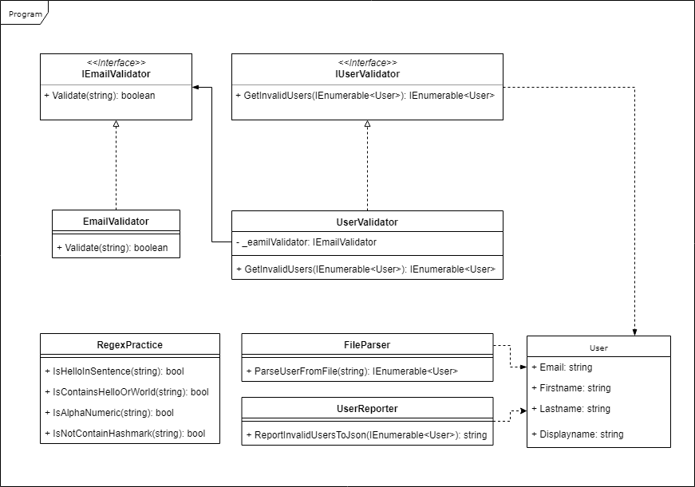
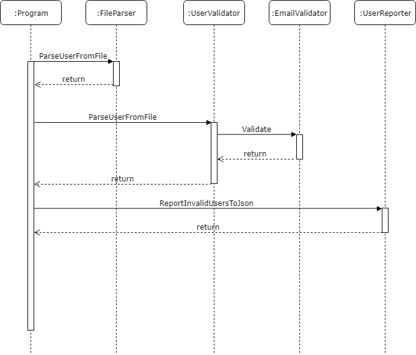

# Szövegkezelés és IO laboratórium

## Labor célkitűzése

A labor során megismerkedhetünk a C# alapvető string kezelésével, a reguláris kifejezésekkel, illetve a fájl beolvasással is. 

A labor során a feladatunk egy tesztekkel lefedett szoftver megvalósítása. A szoftver célja, hogy egy elérésiúttal megadott fájl-t kiolvasson, amiben felhasználói információk vannak. Ezek után el kell dönteni, hogy melyek azok a felhasználók, akiknek az email címe helytelen, majd ezeket a felhasználókat egy JSON formátumú string ként vissza kell adnunk.

A laborban megismerkedhetünk a reguláris kifejezésekkel is, amikre vonatkozóan is találunk feladatokat. Ezek a Practice mappában a RegexPractice fájlban helyezkednek el. Megoldásukkal gyakorolhatjuk a reguláris kifejezéseket, melyeket az email validációjára tudunk felhasználni.

### Reguláris kifejezések
A reguláris kifejezés egy olyan, bizonyos szintaktikai szabályok szerint leírt string, amivel meghatározható stringek egy halmaza. Segítségével könnyedén tudunk szövegrészleteket keresni vagy megvizsgálni, hogy egy adott szövegrészlet egy szabályzatnak megfelel-e.

#### A bővebb információk
* [Reguláris kifejezések C# segítségével](https://docs.microsoft.com/en-us/dotnet/api/system.text.regularexpressions.regex?view=netframework-4.7.2)
* [Regularis kifejezések Wikipedia](https://hu.wikipedia.org/wiki/Regul%C3%A1ris_kifejez%C3%A9s)

## Labor felépítése

A program a következő elemekből áll:
* File Parser: A fájlból olvasást végző osztály.
  * ParseUserFromFile: Egy megadott path-en elérhető fájlt olvas be és állít belőle össze egy User listát.
* User: A felhasználó adatai tárolásáért felelős osztály.
* EmailValidator: Email validálását végző osztály
  * Megvizsgálja hogy egy adott string helyes email formátumú-e
* UserValidator: A felhasználók helyességét vizsgáló osztály
  * GetInvalidUsers: egy User listából visszaadja azokat a Usereket, akik nem validak, jelen esetben akiknek az emailcíme nem helyes.
* UserReporter: A felhasználókról való jelentéseket készíti el
  * ReportInvalidUsersToJson: Egy felhasználó lista alapján készít el egy JSON stringet.

A labor feladata ezeknek a függvényeknek a megvalósítása. A készülő program megérdése érdekében lejjebb találhatjuk a készülő program osztály diagramját, illetve a szekvencia diagramját.

### UML osztály diagram

### Szekvencia diagram
